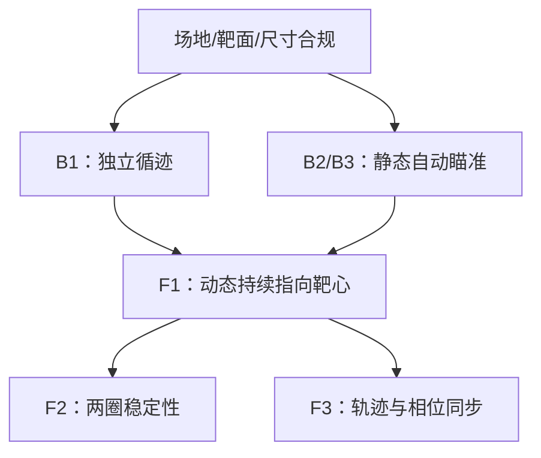

# 2025 电赛 E 题：AI 题面索引

## 0. 给 Agent 的使用规则

1. 本文件是当前工作区关于 E 题的唯一题面事实索引；先读本文件，再提出方案或改代码。
2. 回答或设计时，优先引用需求 ID，例如“`[REQ-TRK-03]` 要求全程投影不能完全脱离轨迹线”。
3. 不要把 `DERIVED` 或 `OPEN` 写成题面硬要求。题面硬要求仅来自 `FACT`。
4. 当前用户只要“题目拆解”。除非用户明确要求，否则不要输出硬件选型、器件购买建议、接线图或具体算法实现。
5. 截图没有完整“评分标准”。涉及分值、F4、计时边界或测量细节时，必须标记为 `OPEN`，不能猜测。

## 1. 任务模型

### 1.1 目标（FACT）

系统由自动寻迹小车和瞄准模块组成：小车沿黑色方形轨迹逆时针自动行驶；车载二维云台控制紫激光方向，使光斑落在固定靶面上。题目分别考察：

1. 小车独立循迹；
2. 静态自动瞄准靶心；
3. 小车运动时持续指向靶心；
4. 小车运动一圈时，激光在靶面半径 6 cm 的圆上同步画一圈。

### 1.2 能力依赖（DERIVED）

## 2. 题面事实索引（FACT）

### 2.1 系统、供电与安全

| ID | 题面要求 | 验收或约束含义 |
| --- | --- | --- |
| REQ-SYS-01 | 自动寻迹小车必须由 TI MSPM0 系列 MCU 控制，包含循迹和电机控制。 | 测试前 MCU 型号须便于查验。 |
| REQ-SYS-02 | 瞄准模块以小车为载体，利用二维云台控制紫激光发射方向。 | 需要二维指向能力。 |
| REQ-SYS-03 | 靶上光斑直径不大于 0.5 cm。 | 不能只保证光斑中心正确。 |
| REQ-SYS-04 | MSPM0 控制板和瞄准模块分别使用两个独立电源开关。 | 不得以一个总开关或纯软件开关替代。 |
| REQ-SYS-05 | 每个控制板须用发光管显示供电状态。 | 两路供电状态均须直观可见。 |
| REQ-SYS-06 | 小车使用车载电池；行驶过程不得人为干涉或遥控；进入测试后不得中途换电池。 | 续航和自主性须覆盖完整测试。 |
| REQ-SAFE-01 | 建议使用波长 405 nm、功率不大于 10 mW 的紫激光笔；避免照射眼睛和皮肤。 | “建议”不是截图可见的硬性限值，但安全上应遵守。 |

### 2.2 车体、轨迹与场地

| ID | 题面要求 | 验收或约束含义 |
| --- | --- | --- |
| REQ-VEH-01 | 整车外廓（含瞄准模块）不大于 25 cm × 15 cm × 25 cm（长 × 宽 × 高）。 | 所有外露件均计入。 |
| REQ-VEH-02 | 采用轮式小车，轮数 3～4 个；不得用履带和麦克纳姆轮。 | 行走机构有明确限制。 |
| REQ-TRK-01 | 轨迹外沿为 100 cm × 100 cm 正方形；边线为黑色，线宽 1.8 cm ± 0.2 cm。 | 正式/自建场地都应满足此基准。 |
| REQ-TRK-02 | 小车沿轨迹逆时针自动寻迹行驶。 | 方向错误即不符合题面。 |
| REQ-TRK-03 | 行驶过程中，小车投影必须在轨迹线上；投影完全脱离轨迹线即本次测试失败。 | 转角、启停和横摆均是高风险时段。 |
| REQ-ENV-01 | 靶面尽量靠墙竖立，周围无强光干扰。 | 场地不能依赖特殊光照。 |
| REQ-ENV-02 | 建议用白色哑光喷绘布做场地，水平铺设于平整地面。 | “建议”不是强制项，但可作复现参考。 |
| REQ-ENV-03 | 除题目要求边线外，场地不得有其他符号标记；场地内外不得架设其他装置设备。 | 不得依赖额外地标、外部标记或外设。 |

### 2.3 靶面与误差定义

| ID | 题面要求 | 验收或约束含义 |
| --- | --- | --- |
| REQ-TGT-01 | 靶面竖立在 AB 线段外 50 cm 处，与 AB 平行，高度不大于 50 cm。 | 是固定空间几何关系。 |
| REQ-TGT-02 | 靶面为 A4 单面紫外感光纸；用 1.8 cm 黑色胶带标外框。 | 感光纸只有一面有感光特性，可重复使用。 |
| REQ-TGT-03 | 靶心用红油性记号笔标记，靶心直径不大于 0.1 cm。 | 靶心是 D1 的参照。 |
| REQ-TGT-04 | 以靶心为圆心，画半径 2、4、6、8、10 cm 的红色圆；圆线宽不大于 0.1 cm。 | 半径 6 cm 圆用于 F3。 |
| REQ-MET-01 | D1 为光斑痕迹到靶心的最大距离；目标为 D1 ≤ 2 cm。 | 按全程最大偏差，而非平均/终点偏差。 |
| REQ-MET-02 | D2 为光斑痕迹到半径 6 cm 红色圆弧线的最大距离；目标为 D2 ≤ 2 cm。 | 按全程最大偏差。 |
| REQ-MET-03 | D1、D2 不超过 2 cm 为满分；每增加 1 cm 扣 1 分，不足 1 cm 按 1 cm 计。 | 超过 2 cm 不一定完全失分，但会扣分。 |
| REQ-MET-04 | 紫外感光纸被照后留下痕迹，痕迹约持续 20～60 秒；照射越强，颜色越深、停留越久。 | 多轮测试的残影会干扰判读。 |
| REQ-TIME-01 | 所有含时间要求的测试，超时则该项为 0 分。 | 时间和精度必须同时满足。 |

## 3. 测试项索引（FACT）

| ID | 前置条件与动作 | 通过条件 | 失分关键 |
| --- | --- | --- | --- |
| TEST-B1 | 小车自动循迹行驶 N 圈；N 可设为 1～5；瞄准模块电源关闭。 | t ≤ 20 s；全程满足 REQ-TRK-02/03。 | 不能只关闭激光，必须关闭瞄准模块电源。 |
| TEST-B2 | 小车放在场地中，位置和姿态自定；启动瞄准模块。 | 2 s 内激光击中靶心；D1 ≤ 2 cm。 | 不能依赖预先手动对准。 |
| TEST-B3 | 小车放在行驶轨迹的指定位置；瞄准初始方向任意；启动瞄准模块。 | 4 s 内自动瞄准靶心；D1 ≤ 2 cm。 | 必须覆盖任意初始瞄准方向。 |
| TEST-F-COMMON | 小车放在 AB 段轨迹上，前沿投影与 AC 线对齐；启动小车和瞄准模块。 | 运动期间激光必须连续发光并指向靶面，否则发挥项不计成绩。 | 不能通过熄光或闪烁隐藏偏差。 |
| TEST-F1 | 满足 TEST-F-COMMON；小车行驶 1 圈。 | t ≤ 20 s；D1 ≤ 2 cm。 | 必须看全程最大 D1。 |
| TEST-F2 | 满足 TEST-F-COMMON；小车行驶 2 圈。 | t ≤ 40 s；D1 ≤ 2 cm。 | 第二圈也必须合格。 |
| TEST-F3 | 满足 TEST-F-COMMON；小车行驶 1 圈，同时激光沿靶面半径 6 cm 红色圆弧同步画圆。 | t ≤ 20 s；D2 ≤ 2 cm；小车 1 圈、光斑正好 1 圈；同步误差 < 1/4 圈。 | 同时满足轨迹误差、圈数和相位误差。 |
| TEST-F4 | “其他”。 | 完整评分标准未出现在截图中。 | 见 OPEN-07。 |

## 4. 可直接使用的派生结论（DERIVED）

| ID | 推导 | 结论 | 使用限制 |
| --- | --- | --- | --- |
| DER-01 | 正方形周长 = 4 × 100 cm。 | 单圈路径长度为 400 cm。 | 仅基于 REQ-TRK-01。 |
| DER-02 | 400 cm ÷ 20 s。 | TEST-F1 的平均速度至少为 20 cm/s。 | 平均速度不代表转角处也安全。 |
| DER-03 | 800 cm ÷ 40 s。 | TEST-F2 的平均速度至少为 20 cm/s。 | 同上。 |
| DER-04 | 对 TEST-B1，路径长度为 400N cm，时间上限为 20 s。 | 平均速度下限为 20N cm/s；N=1/2/5 时分别为 20/40/100 cm/s。 | B1 对不同 N 的实际评分口径见 OPEN-01。 |
| DER-05 | D1/D2 定义中使用“最大距离”。 | 验收应关注整个光痕的最坏点。 | 测量对象的精确操作仍见 OPEN-05。 |
| DER-06 | F3 同时要求车 1 圈、光斑 1 圈、同步误差 < 1/4 圈。 | F3 不是“最终回到起点”即可，而是全程进度需相互匹配。 | 相位测量方法仍见 OPEN-06。 |

## 5. 风险索引（DERIVED：按优先级排查）

| 优先级 | 风险 ID | 触发条件 | 后果 | 首先检查 |
| --- | --- | --- | --- | --- |
| P0 | RISK-01 | 车体投影任一时刻完全脱离轨迹线。 | 本次测试失败。 | 四个转角、启停、车体横摆。 |
| P0 | RISK-02 | 任一带时间项超时。 | 对应项为 0 分。 | 计时边界与最慢工况。 |
| P0 | RISK-03 | 发挥项中激光不连续发光或未指向靶面。 | 该发挥项不计成绩。 | 全程光痕连续性。 |
| P1 | RISK-04 | B1 中瞄准模块仍上电。 | 不符合 TEST-B1。 | 独立开关与状态灯。 |
| P1 | RISK-05 | 只在终点或平均误差满足精度。 | D1/D2 可能超限/扣分。 | 全程光痕最坏点。 |
| P1 | RISK-06 | F3 只验证圆轨迹闭合。 | 可能多圈、少圈或相位超限。 | 车与光斑的圈数/相位。 |
| P1 | RISK-07 | 旧紫外光痕未消退。 | D1/D2 无法可靠判读。 | 每轮测试使用干净基准或等待消退。 |
| P2 | RISK-08 | 额外地标、外部设备或特殊场地条件。 | 违反场地限制或形成争议。 | 场地清理与依赖清单。 |
| P2 | RISK-09 | 车体外廓、轮型或供电展示不合规。 | 可能无法进入测试或失分。 | 赛前物理合规检查。 |

## 6. 未确认项（OPEN：必须保留，不可假定）

| ID | 未确认问题 | 影响范围 | 推荐动作 |
| --- | --- | --- | --- |
| OPEN-01 | B1 的 N=1～5 是任选、随机指定还是必须覆盖多个值？ | 速度、圈数功能、测试策略。 | 查完整评分标准或询问裁判。 |
| OPEN-02 | 各测试的精确计时起点和终点是什么？ | 所有时间项。 | 询问裁判并按最保守口径准备。 |
| OPEN-03 | “投影在轨迹线上”的具体观察/判定方式是什么？ | TEST-B1、TEST-F1/F2/F3。 | 询问光源、观察角度与允许状态。 |
| OPEN-04 | “前沿投影与 AC 线对齐”的允许误差和几何基准是什么？ | 发挥项起始摆放。 | 询问裁判。 |
| OPEN-05 | D1/D2 的测量对象和工具是什么（光斑中心、光痕边缘等）？ | 精度判定。 | 询问测量规则；当前按最保守的全程最大偏差准备。 |
| OPEN-06 | F3 的同步误差如何测量？“圆弧同步画圆”是否要求完整圆周？ | F3。 | 查完整题面/评分标准。 |
| OPEN-07 | F4 “其他”的内容及分值是什么？ | 发挥扩展部分。 | 获取完整评分标准。 |

## 7. Agent 输出与实施边界

当用户后续提出与本题有关的任务时，Agent 应按以下格式工作：

1. **先列关联事实**：给出本次任务涉及的 `REQ-*`、`TEST-*`、`DER-*` 和 `OPEN-*` ID。
2. **明确范围**：说明是在做题面解释、测试设计、代码修改还是硬件方案；未获请求时，保持在题目拆解层面。
3. **先处理 P0 风险**：任何实现/调试建议都不得绕过 RISK-01、RISK-02、RISK-03。
4. **不吞掉歧义**：涉及 OPEN 项时，标记“待确认”，并采用不会违反已知 FACT 的保守解释。
5. **验证输出**：测试记录至少包含：测试 ID、起止时间、圈数、最大 D1/D2、是否连续发光、是否出现投影脱线、结论。

## 8. 最小赛前核对清单

- [ ] REQ-SYS-01 至 REQ-SYS-06 均可展示、可核验。
- [ ] REQ-VEH-01/02 与 REQ-TRK-01/02/03 均通过实测。
- [ ] REQ-TGT-01 至 REQ-TGT-04 的靶面与场地均按尺寸搭建。
- [ ] TEST-B1、TEST-B2、TEST-B3 已分别记录通过。
- [ ] TEST-F1 通过后，再验证 TEST-F2 和 TEST-F3。
- [ ] 测试中记录 D1/D2 的全程最大值，而不是最终位置。
- [ ] OPEN-01 至 OPEN-07 已通过完整题面或裁判答复尽量关闭。
